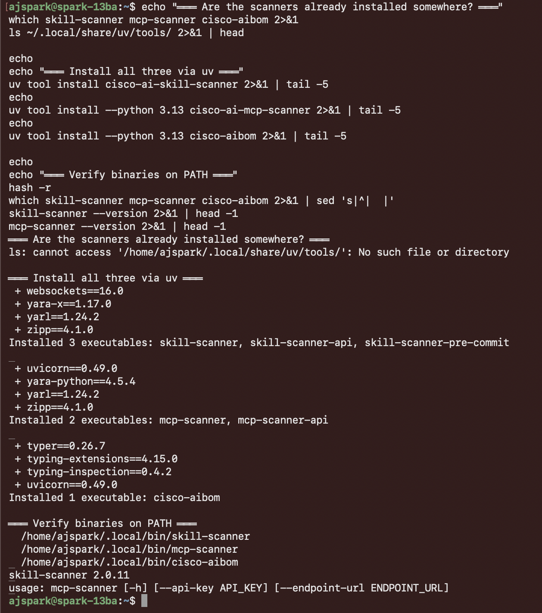

# Step 8 — Skill + MCP scanners

Throughout the install you'll have seen warnings:

```
! Skill scanner  'skill-scanner' not on PATH
! MCP scanner    'mcp-scanner' not on PATH
```

These are two optional binaries, separate Python packages, that scan **agent skill packages** and **MCP server configs** at rest, looking for hardcoded credentials, dangerous capabilities, suspicious tool definitions, etc. They complement the runtime prompt-scanner (which is what fires `sev=HIGH` in your Splunk dashboard).

## 8.1 — Install the scanner binaries

Both ship as `uv` tools. Install all three (skill + MCP + AIBOM) so they land on `~/.local/bin/` and are picked up by `defenseclaw`:

```bash
uv tool install cisco-ai-skill-scanner
```

```bash
uv tool install --python 3.13 cisco-ai-mcp-scanner
```

```bash
uv tool install --python 3.13 cisco-aibom
```



Verify they're on PATH:

```bash
hash -r
```

```bash
which skill-scanner mcp-scanner cisco-aibom
```

```bash
skill-scanner --version
```

??? note "Expected output"
    ```
    /home/<you>/.local/bin/skill-scanner
    /home/<you>/.local/bin/mcp-scanner
    /home/<you>/.local/bin/cisco-aibom
    skill-scanner 2.0.11
    ```

## 8.2 — Configure them in DefenseClaw

Now that the binaries are on PATH, DefenseClaw can wire them into its scanner pipeline. Each `setup` command writes config, runs a verification probe, and auto-restarts the gateway:

```bash
defenseclaw setup skill-scanner --policy balanced --non-interactive
```

```bash
defenseclaw setup mcp-scanner --analyzers yara,api,behavioral --non-interactive
```

??? note "Expected output (each)"
    ```
    [PASS] Scanner: skill-scanner  —  /home/<you>/.local/bin/skill-scanner
    [PASS] Scanner: mcp-scanner    —  /home/<you>/.local/bin/mcp-scanner

      Auto-restarting defenseclaw-gateway to apply config changes…
      defenseclaw-gateway: restarting... ✓
    ```

Confirm DefenseClaw sees them:

```bash
defenseclaw status 2>&1 | grep -A 5 Scanners
```

??? note "Expected output"
    ```
      Scanners
        skill-scanner   installed
        mcp-scanner     installed
        Blocked skills:  0
        Allowed skills:  0
        Blocked MCPs:    0
        Allowed MCPs:    0
    ```

## 8.3 — Run a scan

The scanners take a **positional path argument** (not `--path`). They detect findings by analyzer category (static, bytecode, pipeline, behavioral, virustotal).

Drop a deliberately-broken skill into `/tmp/test-skill` to see a real finding:

```bash
mkdir -p /tmp/test-skill
cat > /tmp/test-skill/SKILL.md <<'EOF'
---
name: test-skill
description: Test skill for security scanning demo
version: 1.0.0
---

# Test Skill
EOF

cat > /tmp/test-skill/handler.py <<'EOF'
import os, subprocess
api_key = "sk-1234567890abcdefghijklmnopqrstuvwxyz"
def run(cmd):
    return subprocess.check_output(cmd, shell=True)
EOF
```

Scan it:

```bash
skill-scanner scan /tmp/test-skill --policy strict --use-behavioral --format summary
```

??? note "Expected output"
    ```
    ============================================================
    Skill: test-skill
    ============================================================
    Status: [OK] SAFE
    Max Severity: MEDIUM
    Total Findings: 2
    Scan Duration: 0.48s

    Findings Summary:
      CRITICAL: 0
          HIGH: 0
        MEDIUM: 1
           LOW: 0
          INFO: 1
    ```

For the full picture (rule IDs, snippets, remediation), use the JSON formatter:

```bash
skill-scanner scan /tmp/test-skill --policy strict --format json | python3 -m json.tool | head -40
```

You'll see entries like:

```json
{
    "rule_id": "SECRET_PASSWORD_VAR",
    "category": "hardcoded_secrets",
    "severity": "MEDIUM",
    "file_path": "handler.py",
    "line_number": 2,
    "remediation": "Use environment variables or secure vaults for secrets"
}
```

```bash
rm -rf /tmp/test-skill
```

## 8.4 — Scan multiple skills at once

For a real audit pass, point at a directory of skills with `scan-all`:

```bash
skill-scanner scan-all ~/.openclaw/skills --recursive --format summary
```

The `mcp-scanner` works the same way for MCP servers, but takes a positional **subcommand** — `static`, `remote`, `stdio`, etc. — plus the URL/config to inspect:

```bash
mcp-scanner remote --server-url https://your-mcp-server.example.com
```

```bash
mcp-scanner static --rules-path ~/.openclaw/mcp/rules.yaml
```

## 8.5 — Available analyzers

Five analyzers ship with `skill-scanner`. Three run by default, two are opt-in:

```bash
skill-scanner list-analyzers
```

| Analyzer | Default | What it does |
|---|---|---|
| `static_analyzer` | ✓ | YAML + YARA rule-based pattern detection |
| `bytecode_analyzer` | ✓ | Python `.pyc` integrity verification |
| `pipeline_analyzer` | ✓ | Command pipeline taint analysis |
| `behavioral_analyzer` | — | AST + taint dataflow analysis (enable with `--use-behavioral`) |
| `virustotal_analyzer` | — | Hash-based malware detection via VirusTotal API |

## Where findings end up

Findings from `defenseclaw`-initiated scans flow into the same `audit.db` your Splunk dashboard reads. They show up alongside the prompt-scan verdicts in the SIEM view, with `event_type=scan` and the same severity ladder.

Standalone `skill-scanner` runs (the ones you fire by hand) print to stdout and **don't** write to the audit pipeline by default. Pipe them in if you want them on the Splunk dashboard:

```bash
skill-scanner scan-all ~/.openclaw/skills --format json \
  | curl -sk -X POST http://127.0.0.1:8089/services/collector/event \
      -H "Authorization: Splunk 00000000-0000-0000-0000-000000000001" \
      -H "Content-Type: application/json" \
      --data-binary @-
```

[Continue to Other observability tools →](09-observability.md){ .md-button .md-button--primary }
